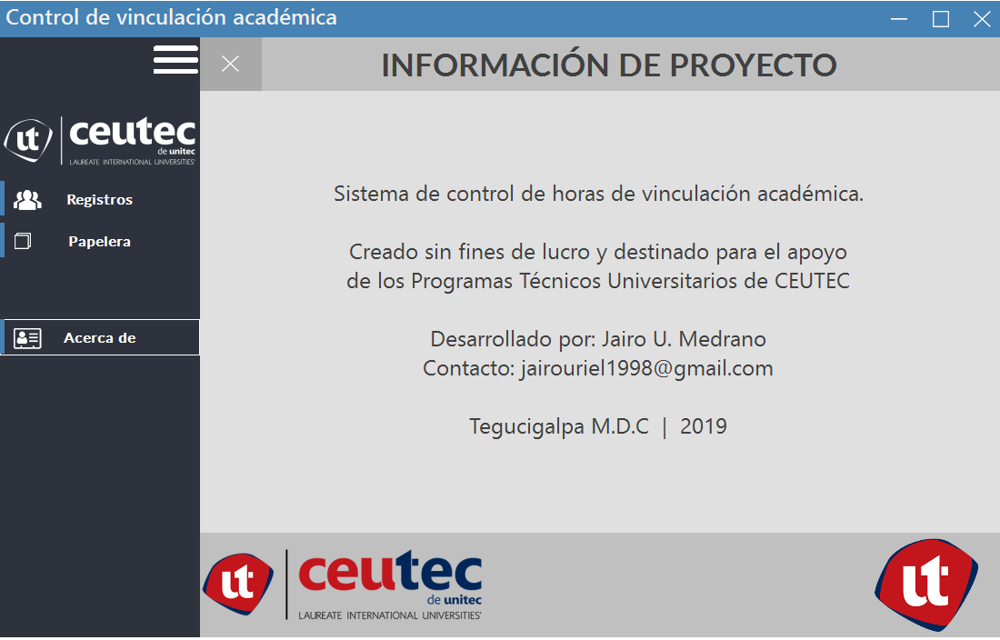

<h3> Sistema de vinculación académica de los programas técnicos universitarios </h3>

Es un sistema de control de horas de vinculación destinado para el personal administrativo de los programas técnicos de CEUTEC, se elaboro con el fín de agilizar las operaciones y mantener mejor orden y control de las actividades de vinculación de los estudiantes.

Made with ❤ by Jairo Medrano

under MIT license
